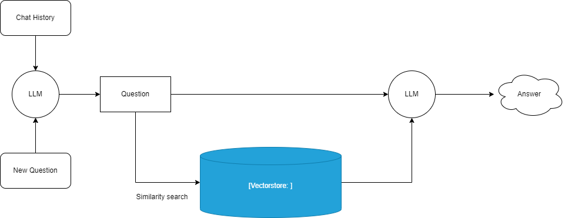

# chatgpt-retrieval

Simple script to use ChatGPT on your own files.

Here's the [YouTube Video](https://youtu.be/9AXP7tCI9PI).

## Installation

Install [Langchain](https://github.com/hwchase17/langchain) and other required packages.
```
pip install langchain openai chromadb tiktoken unstructured
If you are on Windows operating system and this gives a "could not build wheels" error, download Visual Studio Build Tools
```
Modify `constants.py.default` to use your own [OpenAI API key](https://platform.openai.com/account/api-keys), and rename it to `constants.py`.

Place your own data into `data/data.txt`.

## Example usage
Test reading `README.md` in the data folder file.
```
> python chatgpt.py "Is it possible to use the KUKA vpn in vagrant?"
Yes, the KUKA VPN can be used in Vagrant. You can install and use the VPN in the KUKA Vagrant Box by following the provided instructions
```


for more info visit https://blog.langchain.dev/tutorial-chatgpt-over-your-data/