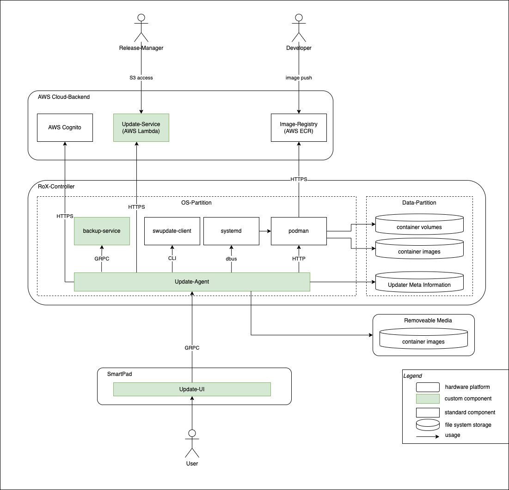

|||
|-|-|
|Build (master) | [](https://dev.azure.com/kuka/RoX%20OS/_build?definitionId=1652&repoName=operation_management_update_agent&branchName=master)|

# Introduction

The `updateagent` is an edge device service written in [Go](https://golang.org/). It enables retrieval and installation
of remote software updates for controllers of the KUKA RoX platform.



The UpdateAgent is mainly responsible for:

* Downloading and interpreting the custom [description](./doc/bundle_description.md) for KUKA-Update-Packages from an
  Update-Backend
* Instrumenting [Podman](https://podman.io/) and [systemd](https://www.freedesktop.org/wiki/Software/systemd/)
  for creating and starting the OCI-Containers of an package.
* Installing OS image updates by instrumenting [SWUpdate](https://sbabic.github.io/swupdate/swupdate.html)
* Providing an GRPC interface for triggering the update

# Additional Documentation

There are various docs around the topic of the update-agent. The following page groups them and is a good starting point
for exploring them:

[Additional Documentation](./doc/toc.md)

## Target platform

The UpdateAgent is designed to run on the KUKA RoX OS.

General requirements for executing test are:

* Linux OS with systemd
* Podman >= 3.0.1
  * with user-space podman.socket enabled (`systemctl --user enable podman.socket --now`)
* SWUpdate >= 2020.11

# Getting Started

The UpdateAgent is implemented in [Go](https://golang.org/). See this [decision](./doc/decisions/programming_language.md)
for reasons.

## Project Layout

Based on this [Standard-Layout](https://github.com/golang-standards/project-layout). From there we use:

```sh
/api # GRPC-API based on .proto-Definition
/cmd # Code for main applications (only config and start-up)
/doc # Documentation
/internal # Code for module internal use only
/pkg # Code that is exported
```

## Prerequisites

For getting started with development you need:

* [Vagrant](https://www.vagrantup.com/)
* [Virtualbox](https://www.virtualbox.org/)
* [Visual Studio Code](https://code.visualstudio.com/) with [Go extension](https://marketplace.visualstudio.com/items?itemName=golang.go)
* If you are new to Go, take the [Tour](https://tour.golang.org/welcome/1)

For MacOS and [Homebrew](https://brew.sh/) just

```sh
brew install virtualbox vagrant visual-studio-code
```

If you want to use git inside the box, install the VirtualBox Guest Additions:

```sh
vagrant plugin install vagrant-vbguest
vagrant vbguest --do install -b
```

In order to be able to access the Kuka repo, you need to copy your private key into the Vagrant box into
`/home/vagrant/.ssh/id_rsa`.

**CAUTION**: Always think twice before copying/moving your private key around,
as it allows to access the repository in your name!

On your host machine, copy the private key into the workspace:

```sh
cp ~/.ssh/id_rsa ~/workspace/kuka/operation_management_update_agent
```

Then inside the Vagrant box, move it into the .ssh directory:

```sh
vagrant@bullseye:/vagrant$ mv id_rsa ~/.ssh/
```

## Repository setup

We use KUKA-internal Go-Packages for our build. These reside in the KUKA-Artifactory.

To set up your local build environment to use the KUKA-Artifactory you have to:

* Start KUKA-VPN
* Login to [KUKA-Artifactory](https://pkg.rd.kuka.com/ui)
* Go to User (in top right) -> `Edit Profile` -> `Generate API Key`
* Copy the API-Key
* Run `tools/setup-artifactory.sh` with your KUKA-User and the generated API-Key

**Attention:**

* You have to be connected to the KUKA-VPN for the Build to work.
* Your API-Key and Username will be stored in the environment-variable `GOPROXY`!

Related to this topic is also [Install and use VPN in the KUKA Vagrant Box](./devdoc/vpn_in_vagrant.md)

## Running

As the UpdateAgent is designed for a specific target platform we use a vagrant box for build and test-execution.
The box has all required dependencies installed to build and run the application. See the [Vagrantfile](./Vagrantfile)
for details.

To access the project in the virtual machine:

```sh
vagrant up # start vm (takes some time)
vagrant ssh # start a ssh session in the virtual machine
cd /vagrant # go to the auto-mounted project-dir
```

Then you must setup the KUKA-Artifactory (see [here](#repository-setup))

```sh
tools/setup-artifactory.sh
```

Now, after setting up KUKA VPN, you have to install the podman version provided by KUKA.

```sh
sudo tools/install-kuka-sw.sh
```

Now you can check the setup by running all tests. Running this for the first
time also requires VPN because it downloads KUKA dependencies.

```sh
go test -p 1 ./...
```

Running `go test` with the `-p 1` parameter constrains the tool to build and test one package at a time
(to avoid errors due to parallelism).

To stop the VM use

```sh
exit # to exit the ssh session (or just Ctrl-D)
vagrant halt # stops the vm
```

**Note:** While we need to build and run inside the box,
it is perfectly fine to edit the source code and use git on your local systems.

## Repository usage

* We do trunk-based development on `master`
* For functional code changes use feature-branches and merge-requests
* Branch names are feature/"story" or bugfix/"bug"
* Doc or Build changes may be committed directly to `master`
* Please rebase (`git config pull.rebase true`)

### Branch Naming Convention

We name branches following the conventions below:

* we use **issue tracker IDs** in branch names
* we use **descriptive** and **actionable** names: The name of a branch should clearly indicate the purpose or changes
  made in that branch.
* we use **underscore** to separate words: This makes the branch name easier to read and understand.
* we use **lowercase** letters: This makes the branch name consistent with the naming conventions used for other branches
  and files in the repository.
* we use the right **prefix** to indicate the branch type: "doc/", "feature/", "bugfix/", "release/" to indicate the type of branch,
  it helps to have a better understanding of the branch and also helps to group and filter branches.
* we keep branch names **short** and **simple**: Long and complex branch names can be difficult to remember and type.

Example: `feature/377_enforce_branch_naming`

## General coding guidelines

* Formatting:
  * The VSCode Go-Plugin has [gopls](https://github.com/golang/tools/blob/master/gopls/README.md) enabled by default
      and should take care of all formatting needs.
  * Otherwise use of [goimports](https://pkg.go.dev/golang.org/x/tools/cmd/goimports) is advised.
* Interfaces:
  * Use sparingly and only where abstraction is needed as they make it harder to change stuff.
  * Good example: podman interfaces are good for writing mocks that do not change the systems state.
* Structs:
  * For structs default to pointers when used as parameter.
  * Write Constructors for exported structs! Name them `New<struct-name>`
* Files:
  * Group code that belongs together in files.
  * Method receivers should be defined directly after the corresponding type
  * When in doubt about ordering methods/types: Ask yourself in which order you would want to read the Docs.
* Packages:
  * Use sparingly, default to files when separating concerns
* Code-generation:
  * Code generation is done with [go generate](https://blog.golang.org/generate), e.g. with the doc-string in
      [API](./api/generate.go)
* Documentation:
  * Document exported identifiers!
  * Be wary of [godoc](https://blog.golang.org/godoc), e.g. start comment with the exported identifiers name.
* Test:
  * Write good tests!
  * Unit-Tests are on a per file basis and should be in filename_test.go in the same package as the file to test.
  * Exported methods should always have at least one test.
  * Use [Testify](https://github.com/stretchr/testify) asserts and mocks where applicable.

## Error handling

### Receiving errors

In general, have a look at [blog: go1.13-errors](https://blog.golang.org/go1.13-errors) for error handling.

* Always check for returned errors
  * If a function returns an error, always check that it is not nil or handle it appropriately

* Handle errors only if you can, otherwise return a wrapped error yourself
  * If possible, enrich the error you received with some context information and return the resulting error.
  * Example: `fmt.Errorf("error while installing bundle %v: %w", bundle.GetIdent(), err)`

* Use inline notation for function calls that only return an error:

    ```go
    if err := i.persistentBundles.AddBundle(bundle, StatusDownloadPending); err != nil {
        return fmt.Errorf("add bundle %v to PersistentBundles: %w", ident.String(), err)
    }
    ```

### Generating errors

* Define error sentinals and wrap them with appropriate context information when using them
  * Definition example: `var ErrBundleNotFound = errors.New("bundle not found")`
  * Usage example: `return fmt.Errorf("%v: %w", ident.String(), ErrBundleNotFound)`
* When writing tests, check that the correct error has been generated with errors.Is()

# Build and Test

## Test Set-up

There are OCI-Images defined in `tools/test-images` which are required to be present during test-execution.

These images are built by `tools/prepare-test-images.sh` which is called during Vagrant initialization.
When you change the image definitions just run the script inside the box again (whith `sudo`).

All files in `tools/test-images` have to be Dockerfiles and should be named `<name>_<tag>` for the script to work.

To execute all tests run `go test -p 1 ./...` from /vagrant. To run test for a specific package, navigate to the package
with cd and run `go test -p 1 ./...` there.

To run one test method only, navigate to the package dir and run e.g.

`vagrant@bullseye:/vagrant/internal/server$ go test -v -run TestListAvailableUpdates`

### Debugging

For debugging on the vagrant box (remote debugging) you can use [delve](https://github.com/go-delve/delve).
It is installed in the vagrant box, which exposes port `11234` for this purpose.
See the delve [command line documentation](https://github.com/go-delve/delve/blob/master/Documentation/usage/dlv.md) for
further details.
Inside the Vagrant Box there is also a convenient alias (`dlvr`) which sets options for a remote debugging session.

**Example**: Test debugging with IntelliJ

* Inside Vagrant Box: Go to the package you want and run `dlvr test .` this starts the debugging server and halts
  execution until a client connects.
* On your host machine:
  * Only once: Setup a *Run Configuration* of type *Go Remote* on port `11234`
  * Set your breakpoints
  * Start your *Run Configuration*

**HINT:** The dlv debugging server does not let you quit it with Ctrl-C but you have to kill the process in another
terminal.
**HINT#2:** When setting up the run configuration, check the box for *On disconnect: Stop remote Delve process*. This
will terminate the process after every run automatically.

### How to do remote debug on the KUKA Controller Hardware

```bash
###### activate repos
sudo mv debian-bullseye.list.deactivated  debian-bullseye.list
###### install go and git
sudo apt update
sudo apt install -y git golang
###### install delve in correct version
git clone --depth 1 --branch 'v1.7.3' https://github.com/go-delve/delve
cd delve
go install github.com/go-delve/delve/cmd/dlv
cd ..

###### to start update-agent with debug:
# systemctl stop update-agent.service
# ua ~kuka/go/bin/dlv -l 0:50965 --api-version=2 --continue  --headless=true  --accept-multiclient   exec /usr/bin/update-agent server

###### forward the port, so we can access it (execute on your local machine):
# ssh -L 50965:127.0.0.1:50965 -N kuka@172.27.5.102
```

### Generate test coverage reports

The example below is based on the tests located under `internal/business/install`. Same applies for other locations.

In order to generate test coverage reports, do the following:

1. go to your vagrant box using `$ vagrant up; vagrant ssh; cd /vagrant` (see above for more details)
2. stay in the root folder or cd to another folder if needed so `$ cd internal/business/install`
3.

execute `$ go test ./... -coverprofile=/vagrant/coverage.out; go tool cover -html=/vagrant/coverage.out -o /vagrant/coverage.html`

This copies the result under `/vagrant` so that it can easily be opened outside of your vagrant box
(i.e. on the host machine)

This will output something similar to:

```sh
ok  	kuka.com/rox/updateagent/internal/business/install	1.036s	coverage: 51.7% of statements
```

The html report can then be found under `/vagrant/coverage.html` and be easily opened in your favorite browser.

## CI

TODO

## Code analysis tools

The vagrant setup contains the following recommended tools for static code analysis:
[vet](https://pkg.go.dev/cmd/vet),
[gosec](https://github.com/securego/gosec),
[staticcheck](https://staticcheck.io/).
In order to receive the best analysis results the tools should be used in conjunction as each does unique checks and
there is very little overlap.

### Usage

* `go vet ./...`
* `gosec ./...`
* `staticcheck ./...`

# GRPC API

The update-agent is used through a gRPC API which is generated from a .proto file. Check `proto-api/operation-management-update-agent-api/proto/kuka/operationmanagement/updateagent/v1/update_agent_service.proto`  
to find the file. The generated API is included in the project with the following entry in go.mod:
`golang.rd.kuka.com/operation-management/update-agent/proto-api-go $version`

## Release new version

In order to release a new grpc version, the changes must be implemented in the .proto file. The new version to be
released must be specified under the section "changes" in the api.yml file found at: `proto-api/operation-management-update-agent-api/api.yml`.

The entry must follow the following pattern:

```log
X.X.X:    
  changes:      
    - entry describing the changes done    
  date: 'yyyy-mm-ddThh:mm:ss+02:00'
```

(X.X.X needs to be replaced with a strict semver version, e.g. 1.3.0)

The grpc changes should then be merged into master through a PR. This should trigger the following pipelines,
alternatively the pipelines can be triggered manually :

* update_agent_proto-api_npm
* update-agent_proto-api_go

The newly built API is then published and can be used within the update-agent by updating the version in the go.mod
file for the entry described above.

# Bundle create

The bundle create command has a required flag for the private key. To use the testing private key, use the following
command to create a bundle file from a yaml.

```sh
/update-agent bundle create -k /vagrant/internal/model/bundle/desc/testdata/test-private-key.pem bundle-description.yaml
```

# SWUpdate

OS Image updates will be done by [SWUpdate Framework](https://sbabic.github.io/swupdate/swupdate.html). First test is
done in `/vagrant/internal/swu/swu_test.go`. This test calls swupdate in dry run mode and normal mode from the cmd line
as follows:

```sh
vagrant@bullseye:/vagrant/internal/swu$ swupdate -v -k swu-public.pem -H SYBbasic:1.0 -e stable,upgrade -i krc5_stable_0.0.1_bilachbach_amd64.swu
```

If you want to create a new key pair and .swu file, just run

``
vagrant@bullseye:/vagrant/internal/swu/testdata$ ./generate_swu.sh
``

.swu file is created from `sw-desription` file, a test script test.sh plus it is signed as
described [here](https://sbabic.github.io/swupdate/signed_images.html#generating-self-signed-certificates).

# Pitfalls

## Case 1

If you get the following error during the Vagrant set-up

```sh
VBoxManage: error: Details: code NS_ERROR_FAILURE (0x80004005), component MachineWrap, interface IMachine
```

make following changes:

* Open MAC system preferences

* Select the security and privacy option.

* Select the General tab and enable the lock icon to make changes.
  Then there will be an option to enable system extensions.
  Instead of the restart, you will see another option.
  Once you click that, you will see Oracle on the list.
  Enable that in the checkbox. It will ask for a system restart and restart the system.

Now if you try to bring up the VM, you won’t see the component MachineWrap, interface machine issue.

## Case #2

If you get the error that the VirtualBox VM was created
with a user that doesn't match the current user running Vagrant.

Try the following `rm -r .vagrant`

## Case #3

If you are having issue executing the SWU Test `TestCallSwupdate_dryRun`, do the following:

* call `$ sudo tools/install-kuka-sw.sh`(withing your Vagrant box)
* then call `$ vagrant reload` (outside of the Vagrant box)

# Credentials

You can find important credentials under the [KeyPass](https://keepass.info/) file `kuka-credentials.kdbx`.

Ask a colleague for the necessary password.

For Mac, following application can be used: [macpassapp](https://macpassapp.org/).

# KUKA Controller

Have a look at the documentation under [doc/how_to_controller.md](./doc/how_to_controller.md) to learn more about the
KUKA Controller and the SmartPad.
