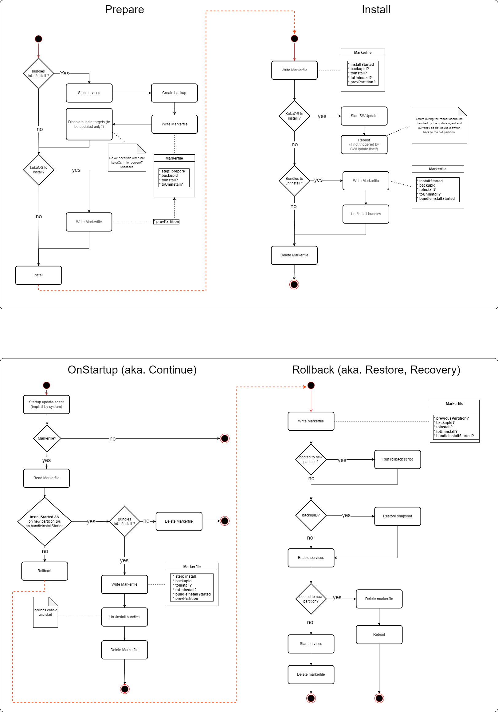
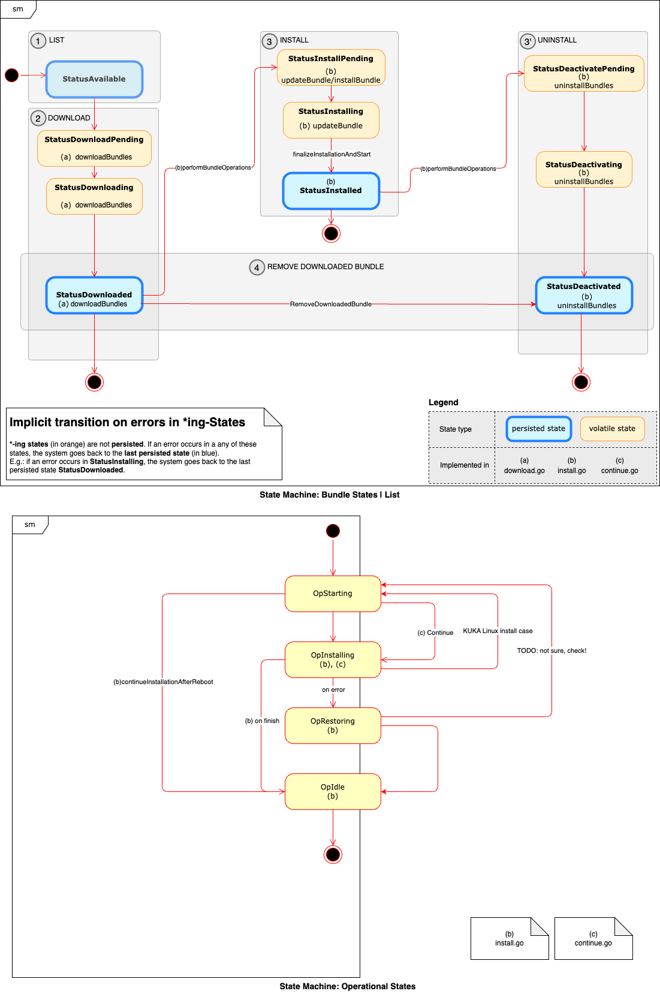
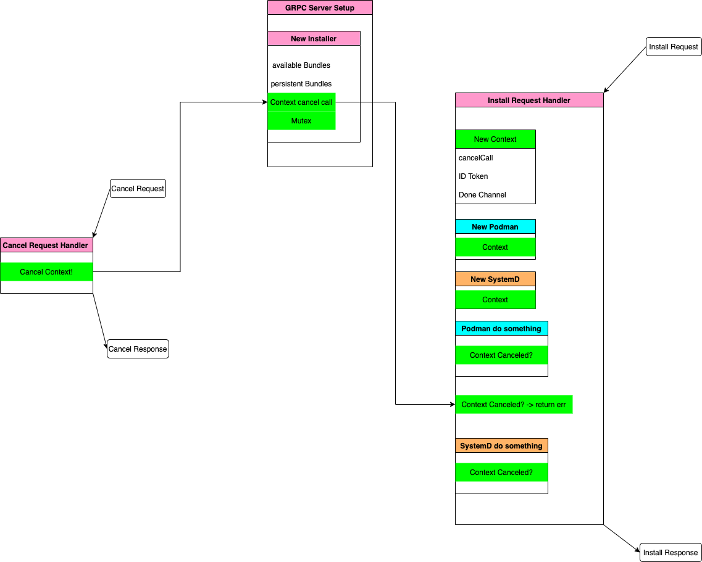

# The Concept of Actions

On a given external input, the `update-agent` goes through various steps to either install, update or remove an artifact.

These main steps have been internal grouped in so called `Actions`.

Actions are a wrapper for **transactional operations that alter the state of the operational system**.

A good overview of the different steps the `update-agent` goes through can be viewed the following diagrams:

Figure 1 - Shows the decision-tree representing the installation flow

Figure 2 - Shows the corresponding installation state machine.

## Types of Actions

On the code level, all major steps that **alter the operational state of the system** have been encapsulated in
**Actions** and are:

1. **Download** Action (`internal/business/download/download.go`)
2. **Install** Action (`internal/business/install/install.go`)
3. **Continue** Action an extension of the Install Action above(`internal/business/install/continue.go`)
4. **Recovery** Action (`internal/business/recovery/recovery.go`)

An `Action` encapsulates the corresponding logic (download, install, etc...) to allow for context based initialization
of system interfaces. This allows for cancellation of the context to effect external calls.

The following diagram gives an overview about how contexts are handled in the `update-agent`.

## Structure of Actions

Action must expose a function to the outside word: `Execute()`. This is the **entry-point** of any action.

Every `Action` provides a `struct` of the form [action-type]Action. Example for **Install** will be `installAction`.

An `Action` also must provide a **constructor** function with the name `NewAction` used for instantiation.

## Interaction

An Action is called from the top-level API (api.go) layer and this is the only layer where multiple Actions can be
combined.
