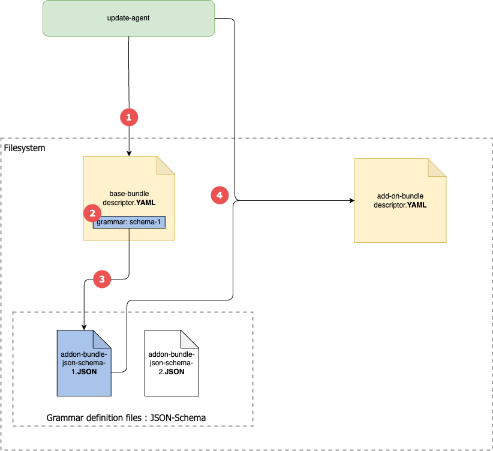
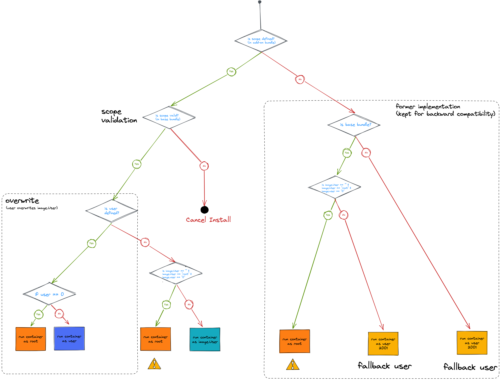

# Concept : Scopes for Addon Bundles

This requirement will introduce **Scopes** for Add-on Bundles as a dedicated property in the bundle-description to restrict
the available config options that are usable in the bundle-description of addon bundles.

Scopes are only applicable to add-on bundles. They defines what an add-on bundle is allowed to do.

In the current implementation, Base Bundles are the only bundles that are allowed to:

- run as root
- adding new capabilities (capAdd)
- allowing it containers to use the realtime flag

The idea is to extend these capabilities also to add-on bundles.

These behaviours will be controlled by defining a so-called **bundle scope**.
This will extend the current available **implicit** scopes `base-bundle-scope` and `normal-addon-bundle-scope`
with a new one called `realtime-scope`.

We are also going to explicitly define these two add-on scopes and assign them to add-ons:

- `normal-addon-bundle-scope`
- `realtime-addon-bundle-scope`

# Scope types

To sum up, following scopes will now be available

- base-bundle (implicit)
- realtime (explicit)
- normal-addon (explicit, default add-on scope)

## normal-addon

This is the current implicit scope all add-on bundle have. It is planned to introduce further restriction for
3rd-party add-on bundles in the future. See:

- https://dev.azure.com/kuka/RoX%20OS/_workitems/edit/165472
- https://dev.azure.com/kuka/RoX%20OS/_git/operation_management_update_agent/pullrequest/41203?_a=files

In the future this will be declared as a **default** explicit add-on bundle scope.

## realtime

This scope will be the new one. It will give extend the right current add-ons bundle have to a sub-set of the rights
base bundles currently have, namely the possibility to:

1. to **run container as root**
2. to **define capabilities** aka. **capAdd**
3. to allow containers to define the **realtime** flag, and
4. to allow **init containers**

These system parameters that a given scope allows to configure/specify will be called **scope keys**.

### Examples:

The **scope key** `capAdd` will be of type array of strings with a specific list of allowed *container capabilities*.

### capAdd

Following values of capAdd are allowed for the base bundle:

- CAP_SYS_NICE
- CAP_IPC_LOCK
- CAP_NET_ADMIN
- CAP_NET_RAW
- CAP_SYS_RESOURCE

See also: https://dev.azure.com/kuka/RoX%20OS/_git/rox_deployment?path=/bundles/robotics-base-bundle/robotics-base-bundle_1.1.0.yaml

All values for capApp can be found here [here](https://man7.org/linux/man-pages/man7/capabilities.7.html).
 
For more details on the capAdd values we are currently using, see:
- https://dev.azure.com/kuka/RoX%20OS/_git/rox_deployment?path=/ansible_new/container_specs/fieldbus_profinet.yml&version=GBfeature/profinet&_a=contents and
- https://man7.org/linux/man-pages/man7/capabilities.7.html

## base-bundle

This is the currently implicit scope our base bundles have.

## Validation

The various keys will expect a range of values. Ideally, we would like to be able to validate both the allowed 
**scope keys** and the corresponding **values**. A good example here is the list of capabilities the `capAdd` scope key
allows. This will be the job of the validation task.

Validation in our context means that the allowed scope keys and values are checked before an add-on bundle is installed.
Depending on the result of the validation the installation of the concerned add-on will be interrupted with a meaningful
error message.

A linter (that checks against a KUKA YAMl grammar) during the authoring process is **out of the scope** of this concept.

### Scope Checks & Enforcement

In the current implementation, the go library https://github.com/go-yaml/yaml is used for marshalling/unmarshalling
YAML files. The validation is done programmatically (by providing a struct that represents the expected YAML structure)
and **no schema** is used.

We provide a model (as struct) for the YAML we are expecting and validate programmatically in go.

In the chapters below, a more flexible solution will be presented. It will allow to validate (in the first run) base
bundle description files without the necessity to change code. The validation rules will be moved outside of the go code
and moved into a schema file that can be easily changed.

#### Suggested solution for validating add-on bundles



Following steps will be executed before for the validation of an add-on bundle:

1. The `update-agent` parses the base bundle descriptor (YAML)
2. the `grammar` (field) is extracted. It points to the schema to be used for the validation of the add-on bundles. 
   In this example, JSON-Schema is used as grammar definition file.
3. the grammar file (**JSON-Schema**) is retrieved based on the extracted field above
4. the `update-agent`than uses the JSON-Schema to validate the add-on bundle descriptor file (YAML).

#### How to validate add-on bundles

In order to provide a more flexible way of validating the bundle description files (without code changes), 
two solutions have been suggested to define the grammar:

1. Use of `JSON-Schema` 
2. Use of `protobuf`

Both solutions have been evaluated, and the outcomes are described below.

#### Set the grammar (for validation)

Since the definition of the grammar to use has also to be done in a more flexible way, it has been decided to use the
base-bundle description file for this purpose. The idea is to add a new field in the base bundle called e.g.
`addon-grammar` that will point to the grammar file to use for add-on-bundle validation.

#### Protected against unauthorized changes

Signing using a public key will ensure that bundles (base and add-on) definition files are protected against 
unauthorized changes.

### Evaluation of validation strategy

#### JSON-Schema

The idea here is to use the well established JSON-Schema (see: [specification](https://json-schema.org/specification.html))
to validate bundle description YAML files.

This is possible by combining two go libraries:

- [yaml.v3](https://gopkg.in/yaml.v3) and
- [jsonschema](https://github.com/santhosh-tekuri/jsonschema)

An evaluation based on these two library has been made.

The main advantages here are:

- JSON and YAML are equivalent (based on the subset of YAML future currently in use in our configurations)
- No intermediate transformation is necessary (such as the code generation necessary from the *.proto file to
  go `struct`)
- Due to it's proximity to YAML, a JSON-Schema is very easy to read
- Linting (in code editors such as VS Code or JetBrains IDEs) is for free. See the attached resources below.

#### Protobuf

Protobuf could be used to generate code for the bundle validation. Each scope is defined in protobuf as an
individual object (message). The resulting struct is then used for the target of the unmarshalling of the bundle
description yaml.

Advantages:

- Protobuf is already being used for the generation of the gRPC API
- Message definition is fast and easy to implement

Disadvantages:

- requires code generation
- field naming cannot be specified (f.e. exampleField could not be mapped to example_field)
- missing keys need to be checked manually to ensure functionality
- additional keys need to be checked manually to provide user feedback
- specific value sets can only be expressed as enums in protobuf, the mapping has to be called manually

### Recommendation

Based on the evaluation above, we strongly suggest to go the **JSON-Schema** way.

## Implementation steps

In the first draft of the **add-on scope** feature (1.1), we will do without the externalization of the grammar, i.e.
neither a JSON-Schema nor a Protobuf based validation of the Bundle will be implemented.

In the first iteration:

1. a new key called `scope` will be introduced on the top level of add-on bundles description which will have as value 
   a `scope id` (e.g. `scope: "run-as-root"`).
2. in the base bundle, the `scopeDefinitions` field (at the top level) will define the list of scope that can be used.

Example for a base bundle scope definition:

```
scopeDefinitions:
    - run-as-root
```

### Workflow in the current 1.1 implementation



**Workflow in the current 1.1 implementation**

### Linting

If JSON-Schema was chosen as grammar description language, it gives **bundle authors** another
advantage: the possibility to bind the JSON-Schema in the most popular IDE/editors to support
them during the authoring process of bundles.

The solution has been tested using **VS Code**. See the attached resources below.

Currently the supported IDEs are:

- IntelliJ IDEA
- PhpStorm
- PyCharm
- Rider
- RubyMine
- Visual Studio 2013+
- **Visual Studio Code**
- Visual Studio for Mac
- WebStorm
- JSONBuddy

## Resources

### Data

The first draft of the JSON Schema provided by KUKA can be found under
`operation_management_update_agent/internal/business/validation/references/schema.json`

The first draft of the JSON Schema provided within the PoC developed for this concept can be found under
`operation_management_update_agent/internal/business/validation/references/bundle-schema.json`

### Validation

- https://zhwt.github.io/yaml-to-go/
- https://forum.golangbridge.org/t/validate-yaml-schema/25658/3
- https://github.com/xeipuuv/gojsonschema
- https://stackoverflow.com/questions/49442799/validate-yaml-schema-with-golang-semantic-check
- https://github.com/json-schema-org/json-schema-spec

### About JSON-Schema strict validation

- https://github.com/json-schema-org/json-schema-spec/issues/682

### YAML Linting (for free)

- https://frontaid.io/blog/json-schema-vscode/
- https://medium.com/@alexmolev/boost-your-yaml-with-autocompletion-and-validation-b74735268ad7


