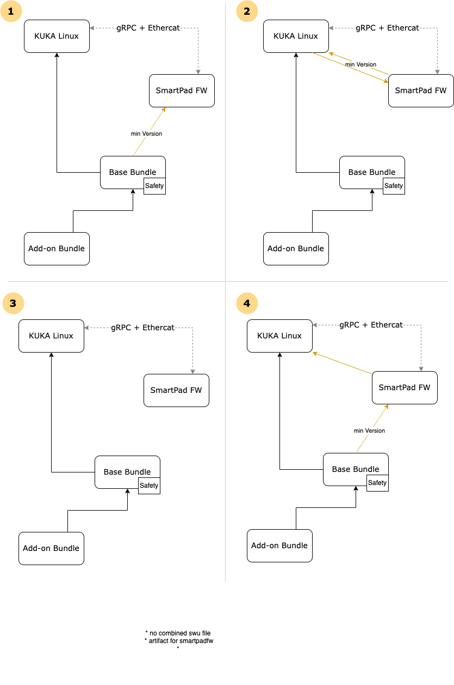

# Concept: SmartPad update

The update-agent currently handles updates for the OS and software bundles running on the controller,
while the SmartPad is updated separately.
This concept proposes to expand the functionality of the update-agent to include the update process of the SmartPad.
Beyond the updating itself, the update-agent could also handle dependencies between the
smartpadImage and software on the controller, i.e. OS or base bundle.

## Current state

At the moment the smartPad is updated independently of the controller using either a USB stick or the web UI.
The stick must contain a .swu file which is then executed using swupdate,
in case of an update via the web UI the swupdate forward mechanism is used.

## SmartPad update

The software to be installed on the smartPad is referenced as smartPad update or smartPadImage both meaning the same.
A combination of firmware and OS running on the smartPad and being installed together.

## Proposed solutions

### Option 1: Separate Smartpad update artifacts

Currently, the update-agent handles two separate update mechanisms for two different artifacts: bundles and KUKA Linux.
This solution proposes to add a 3rd type of artifact specifically for the update of the SmartPad.

#### Locations

*Note: Currently the smartpad is updated via an USB stick connected directly to the smartpad. This case is not
controlled by the update-agent and will not be in the future. It can be considered a manual overwrite. The
update-agent operates on the USB stick connected to the controller.*

Identical to bundles and kuka linux the SmartPad update file can be installed from a local USB location or the remote
backend.

* **Backend** : The backend stores the new update artifacts in a separate s3 bucket and the artifacts are uploaded
  manually by KUKA via AWS tooling. The update-agent accesses the backend through a lambda function, listing the S3
  buckets content.
* **USB** : The new smartpad update files can be provided in the same USB directory as the current artifacts. They are
  distinguished by file name.

In both cases the files and necessary meta information is identified based on the naming convention described below.
For both locations the storage and download process is identical to the existing OS update.

#### Dependencies

*Note: The first version of the SmartPad update mechanism will assume the model 3 in the diagram below.
For further information about this decision see [Decision](../decisions/smartpad_update.md).*

The SmartPadImage has dependencies to the kuka linux version running on the controller as well as the UI container
which comes with the base bundle. Different versions of modeling the dependencies can be seen in the following image:



#### Filename convention

Additional meta information about the individual artifact is represented through the file name convention:

``` {UpdateTypeMarker}_{Identifier}_{Version}.swu ```

* UpdateTypeMarker: Marks what kind of update the swu file performs, i.e. Kukalinux, Smartpad, .... E.g. KL: Kukalinux
* Identifier: String identifying the update
* Version : Version of the update, in strict Semver format

The current file name convention for the OS update artifacts should also be changed to include the UpdateTypeMarker.

#### API Changes

The gRPC API of the update-agent needs to be adjusted to handle the new tasks. Additionally, to the changes described
below the API could also be extended with a method to retrieve the current SmartPadImage version from the update-agent.

##### Variation 1: Integrate into existing gRPCs methods

The already existing calls are expanded to also include the SmartPadImage update. Mainly the following calls:

* ListAvailable -> returns also available SmartPadImage
* Download -> additional parameter to identify smartpadImage for downloading
* Install(/Update/Deinstall) -> additional parameter to identify smartpadImage for install

Disadvantages:

* More difficult to implement
* More prone to errors

Advantages:

* Unification
* Complete rollback of controller is possible

##### Variation 2: Separate gRPC methods

*Note: This solution is not going to be used.
Separating the firmware update into a new gRPC call will make future dependency checks difficult.*

The SmartPadImage-update is triggered on its own.

* ListAvailable -> returns also available SmartPadImage
* Download -> additional parameter to identify smartpadImage for downloading
* InstallSmartPadImage (**New!**) -> single parameter specifies the version to be installed.

Disadvantages:

* No rollback
* SmartPad update needs to be triggered manually after the software update

Advantages:

* Easy to implement
* Easier to maintain

#### Advantages of Option 1

* Dependencies can be recognized and handled by the update-agent
* Updates can be applied independently while maintaining compatibility

#### Disadvantages of Option 1

* High effort to properly define/implement
  * Implementation necessary in update-agent and backend
  * Implementation necessary in frontend (smartpad)
* No downgrade functionality (in line with bundles and kukalinux)

### Option 2: Integrated in OS update

*Note: This solution is not further considered as the smartpad should be updatable without updating and restarting
the controller.*

#### Idea

* Extend the sw-description of the base-image with an additional [swu-forward](https://sbabic.github.io/swupdate/handlers.html#swu-forwarder) for SmartPad to implement both SmartPad and controller updates.

#### Preconditions

* SWUpdate HTTP Port must be accessible from controller
* SWU is always executed after base-bundle install (should be OK)

#### Disadvantages of Option 2

* Smartpad update cannot be done individually
* New OS needs to be released and installed in order to update the smartpad
* Dependency to base-image (and contained UI-container) may not be expressed directly but only over base-bundle ->
  OS-Image dependency
* When a SmartPad is connected to another controller, downgrading or automatic update of the SmartPad is not possible
* SWU-Files are bigger with SmartPadImage (ca. 240 MB, zlib)

#### Advantages of Option 2

* Technically no changes to update-agent necessary

### Decision

[Option 1](#option-1-separate-smartpad-update-artifacts), [Variation 1](#variation-1-integrate-into-existing-grpcs-methods):
Separated smartpad update artifacts will be used and the existing gRPC calls will be extended.
This option allows the individual update of the smartpad controlled by the user while integrated into the existing
update calls.

This solution allows for the future handling of dependencies related to the SmartpadImage. The first version however
does not implement any dependency handling or checking. See section [Dependencies](#dependencies) for more information.

## Connecting to different controllers

A SmartPad previously connected to one controller can be connected to another one, potentially running a different OS and/or base bundle.
This could lead to a scenario where a SmartPad is connected to a Controller running non-compatible software.

### Possible scenarios

* SmartPadImage outdated: The base bundle installed on the controller requires a newer version of the SmartPadImage.
* SmartPadImage compatible: The SmartPad connects successfully to the controller and can manage all future upgrades via
  the UI.
* SmartPadImage newer than base bundle: The smartPad is not supposed to be downgraded. Therefor this case cannot be handled
  and all SmartPadImage versions need to be backwards compatible.

The first scenario "SmartPadImage outdated" makes it necessary for the update-agent to perform the update automatically
without user interaction. This differs from the current user controlled update process for the other artifacts.

*Note: For the first implementation of the SmartPadImage update only the second case "SmartPadImage compatible" is being
considered, as the third case "SmartPadImage newer than base bundle" cannot be handled without the ability to downgrade
the smartpad and the first case "SmartPadImage outdated" requires precise information about compatible versions.*

### Retrieve smartpad version

For all scenarios to be detected and handled correctly the update-agent requires information about the version currently
running on the smartPad. Updates can then be selected and performed based on the retrieved information.

#### Option 1: WebChannel

The UI retrieves the information about the SmartPadImage from a QWebChannel Interface.

#### Option 2: gRPC on smartpad

The SmartPad offers an encrypted gRPC interface for testing which can be used to retrieve the required information.
To use the interface a key and certificate are required.

#### Option 3: Receive from UI

Instead of querying the smartpad for information the update-agent receives the current SmartPadImage version from the UI.
The update-agent's gRPC interface is extended, so that the request send from the UI includes information about
the SmartPadImage.

#### Decision for retrieval of smartpad version

[Option 2](#option-2-grpc-on-smartpad).

The update agent will receive the version of the installed SmartPadImage from the gRPC interface.
The key and certificate will be provided with the matching Kuka Linux release.

## Technical implementation

As described above the smartpad is currently being updated via swupdate.
This will still be the case.
In order to perform the update from the update-agent running on the controller a new functionality will be used:
[SWU-Forwarder](https://sbabic.github.io/swupdate/handlers.html#swu-forwarder).
This allows the installation of .swu files on the connected device.

```conf
images: (
        {
                filename = "image.swu";
                type = "swuforward";

                properties: {
                        url = ["http://192.168.178.41:8080"];
                };
        });
```

For the update to be run on the Smartpad the SWUpdate HTTP Port must be accessible from the controller.
The .swu file will be given to SWUpdate on the controller which then forwards the file to the specified address (properties>url).
SWUpdate running on the Smartpad will then install the file locally similar to a regular installation.

A second option via REST interface was implemented to supress a controller reboot after updating the smartpad
(see: [direct smartpad swu update](../decisions/direct_smartpad_swu_update.md)).

### Smartpad rollback

The smartpad is updated using an a/b update.
The final step of the installation is the change to the boot partition,
causing the smartpad to be booted into the updated partition.
Errors during the installation cause the smartpad to
be rebooted before the boot partition is changed and therefor maintain the current system state.

### Verify update success

SWUpdate provides feedback on a successfull installation.
Additionally, the update-agent could verify the update success using the retrievable smartpad version
(for more details about the retrieval see the section [Retrieve smartpad version](#retrieve-smartpad-version)).

### gRPC changes

As previously mentioned [Option 1](#option-1-separate-smartpad-update-artifacts) requires changes to the existing gRPC methods. The new gRPC API can be found
[here](../../proto-api/update-agent-api/proto/kuka/operationmanagement/updateagent/v1/update_agent_service.proto).

The changes done to the api not only allow for the handling (find, download, install) of smartpad updates but
of potential other types of firmware in the future. The main changes are highlighted below.

New types:

```protobuf
// Type to describe a firmware identifier in a unique way.
// @Since 1.4
message FirmwareIdentifier {
  // The id of the firmware.
  // @Since 1.4
  string id = 1;

  // The version of the firmware image.
  // @Since 1.4
  string version = 2;
}

// Type to describe a Firmware.
// @Since 1.4
message Firmware {
  // The identifier of the firmware.
  // @Since 1.4
  FirmwareIdentifier identifier = 1;

  // The target of the firmware.
  // @Since 1.4
  FirmwareTarget target = 2;

  // The location where the firmware will be installed from.
  // If the firmware is already installed, the location is CONTROLLER.
  // @Since 1.4
  Location location = 3;
}

// Enum for the possible targets of a firmware.
// @Since 1.4
enum FirmwareTarget {
  // Target is not explicitly specified.
  // @Since 1.4
  TARGET_UNSPECIFIED = 0;

  // Target is the smart pad.
  // @Since 1.4
  TARGET_SMARTPAD = 1;

  // Target is the controller.
  // @Since 1.4
  TARGET_CONTROLLER = 2;

  // Target is the robot.
  // @Since 1.4
  TARGET_ROBOT = 3;
}
```

New Method:

```protobuf
  // Gets details about all currently installed firmware across multiple targets.
  // The request may specify the desired firmware target in order to receive information specific to the target.
  //
  // Error codes:
  //   No individual errors expected.
  // @Since 1.4
  rpc GetInstalledFirmware(GetInstalledFirmwareRequest) returns (GetInstalledFirmwareResponse);

```

Additionally, many of the requests and reponses of existing methods where extended to include the new types.
All changes where developed and discussed with the UI team.
