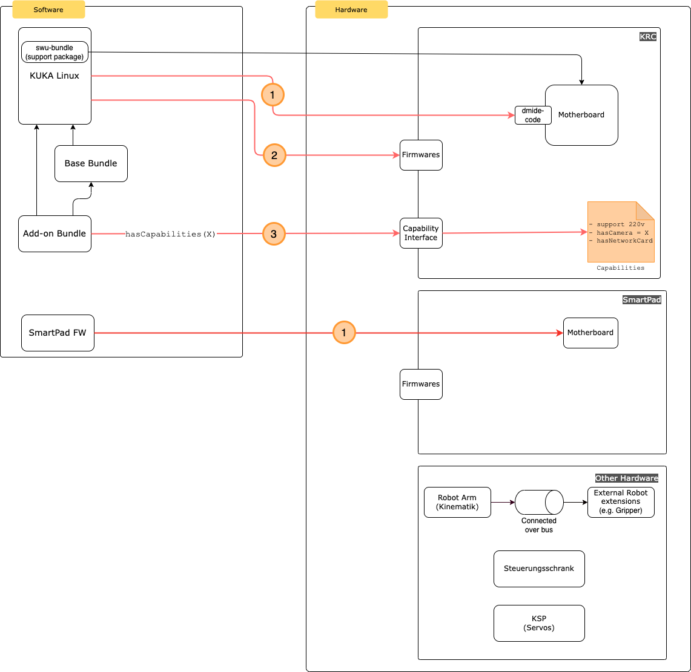

# Concept: Group Access Restriction for third-party Bundles

|                |                                                                            |
| -------------- |----------------------------------------------------------------------------|
| Created on     | 2022-12-16                                                                 |
| Last updated   | 2022-12-16                                                                 |
| Reference link | [Story#165472](https://dev.azure.com/kuka/RoX%20OS/_workitems/edit/165001) | 

## Introduction

Artifacts that can be installed on the KUKA controller using the update-agent are

- OS (KUKA Linux)
- Base Bundles and
- Addon-Bundles

Those artifacts are versioned using [SemVer](https://semver.org/) and the dependency resolution is done in the sequence
describe above (addon-bundles -depends on-> base-bundle -depends on-> OS) using the go the library
https://github.com/Masterminds/semver and the implementation done mostly here [compatible.go](https://dev.azure.com/kuka/RoX%20OS/_git/operation_management_update_agent?version=GBmaster&_a=contents&path=/internal/business/info/compatible.go).

The goal of this concept is to also take possible dependencies to the hardware into account.

### Possible solutions

The diagram below shows the possible solutions.

#### Option 1

For this option, a dependency is defined from e.g. the KUKA OS
to the specific motherboard denoted by its `dmide` code.

This option has been rejected for the time being it does not provide any additional value to the customer at this moment.

#### Option 2

In the second variant, we have suggested to avoid a direct dependency to
a hardware component but rather define an indirect dependency against
a given firmware.

#### Option 3

The last solution suggests the definition of a list of **capabilities**
on the controller side. One being e.g. the supported **voltage**.
The list of capabilities will then be fetched during the validation process
of each bundle and checked.

E.g. if an add-on bundle supports a fixed voltage span, the `update-agent`
retrieves the list of **capabilities** of the controller
(defined by the combination of given hardware parts) and checks against those
**capabilities** just before the add-on bundle is installed. 