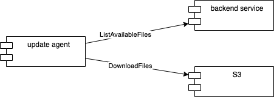

# Serving OS update and bundle files

For serving OS update and bundle files from the cloud backend to the update-agent, we determined three possible 
approaches, which are discussed below.

For all proposed solutions, the following assumptions are made:

* Images that are referenced in bundle files are served by AWS Elastic Container Registry (ECR)
* Access to all AWS resources is secured by IAM policies and only available to authenticated and authorized users
* The required authentication token is provided by the UI to the update-agent
* For upload of OS update files and bundle files into the respective S3 buckets, existing standard interfaces will be 
  used (e.g. AWS Management Console or CLI)

## Proposal 1: S3-only setup

The OS update files and bundle files are stored in S3 buckets, which are directly accessible by the update-agent.

A bucket naming convention is used for organizing files in the buckets.

The update agent enumerates the files in the S3 buckets itself. The S3 base path is configured in the update agent 
configuration file.

```
Exemplary bucket organization:
- os
  |- krc5
  |    |- stable
  |    |- dev
  |- krc6

  [...]

- bundles
  |- stable
  |- dev
```

Advantages:

* No implementation and infrastructure efforts for backend service

Disadvantages:

* No intermediate mechanism for controlling list of available files
* S3 storage publicly reachable (but secured by IAM)

## Proposal 2: File storage on S3, file listing via backend service

The OS update and bundle files are stored in S3 buckets, which are directly accessible by the update agent.

1. The update agent contacts the backend service for retrieving a list of available OS update and bundle files.
2. The backend service compiles lists of S3 storage locations for the available OS update and bundle files and returns 
   them to the update agent.
3. The update agent directly download the respective files from S3.



Advantages:

* Intermediate mechanism for controlling list of available files (needs accompanying IAM policies on S3)

Disadvantages:

* Additional implementation and infrastructure efforts for backend service
* S3 storage publicly reachable (but secured by IAM)

## Proposal 3: Complete encapsulation via backend service

The OS update and bundle files are stored in S3 buckets, which are only accessible for the backend service on AWS.

1. The update agent contacts the backend service for retrieving a list of available OS update and bundle files.
2. The backend service compiles lists of available files (without concrete locations) and returns them to the update 
   agent.
3. The update agent requests the download of individual files from the backend service, which serves the binary data to 
   the update agent.


Advantages:

* Intermediate mechanism for controlling list of available files
* S3 storage not publicly reachable

Disadvantages:

* Additional implementation and infrastructure efforts for backend service
* Serving binary data via backend service potentially complex, especially for large files (Lambda runtime limit of 15 
  minutes, might require different solution like additional microservice)

## Suggested decision

Based on the tradeoff between simplicity and flexibility, we suggest **proposal 2** to be implemented. Compared to the 
direct S3 file listing of proposal 1, the additional layer of indirection via the backend service allows for easier 
adjustments to be made in the future without requiring an update of the update-agent on the controller.

Regarding security, compared to proposal 3, both S3 storage and backend service access need to be properly secured 
against unauthorized access. This is similar to the Elastic Container Registry (ECR), which will also be publicly 
accessible, but secured against unauthorized access. Hence opening S3 for public but protected access does not pose an 
excessive security risk.
