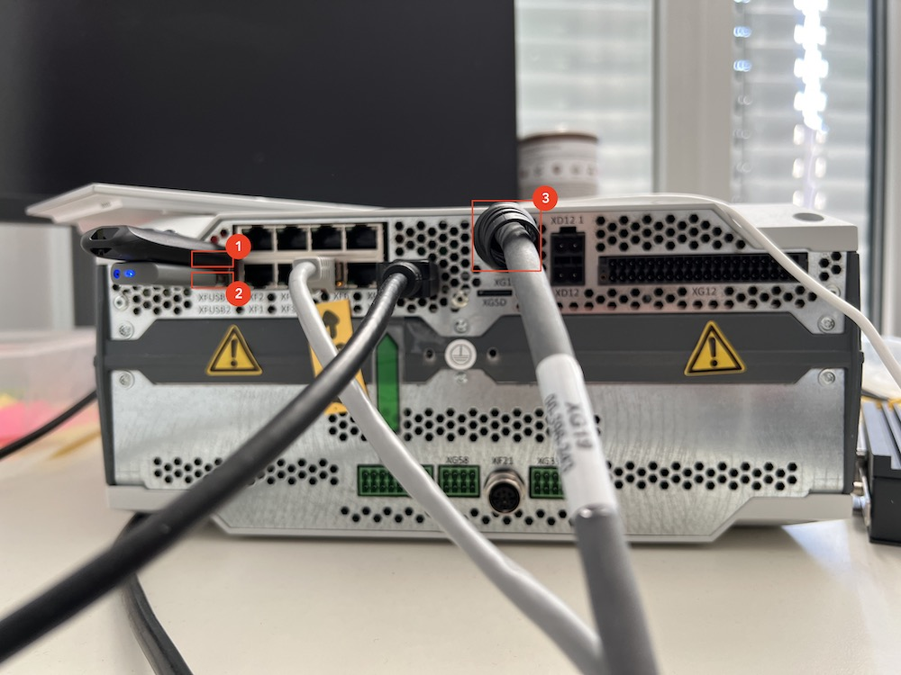
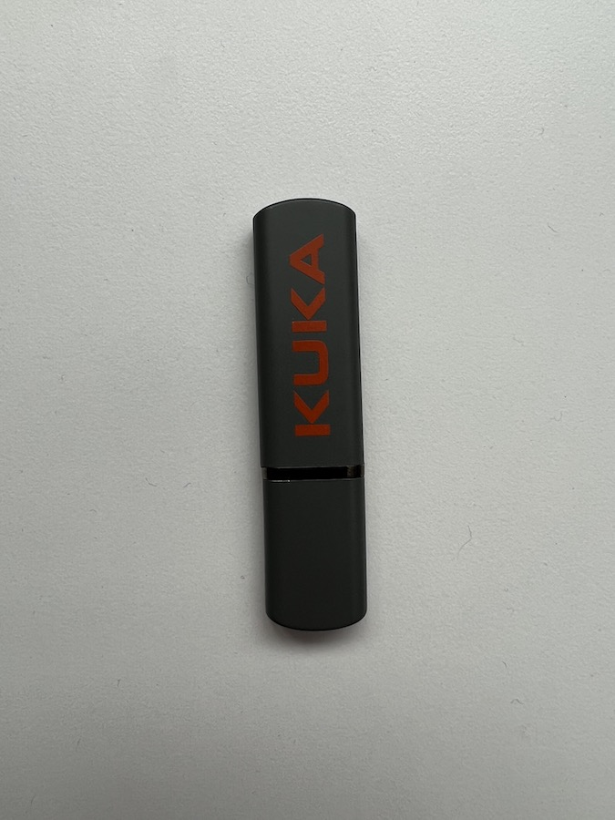
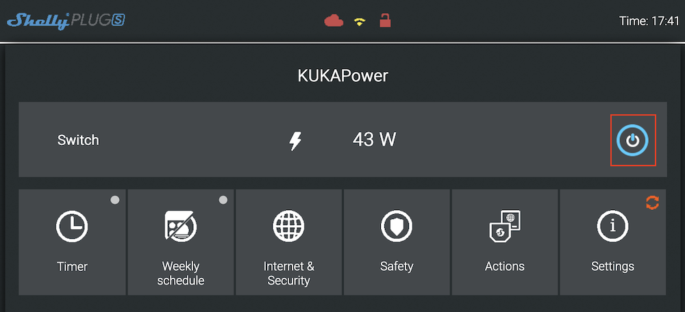
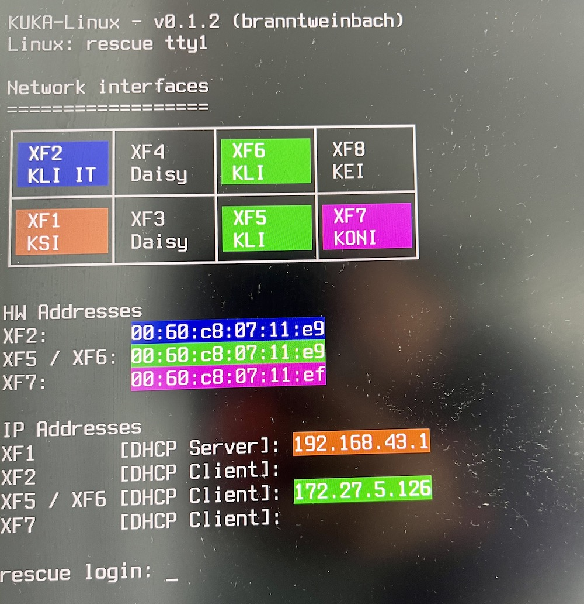
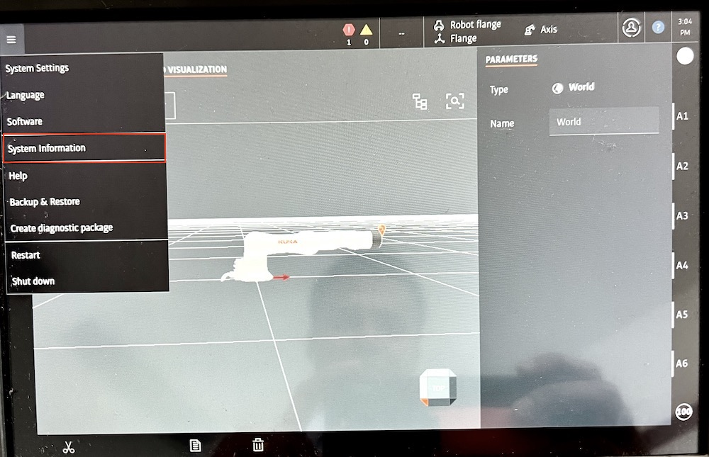
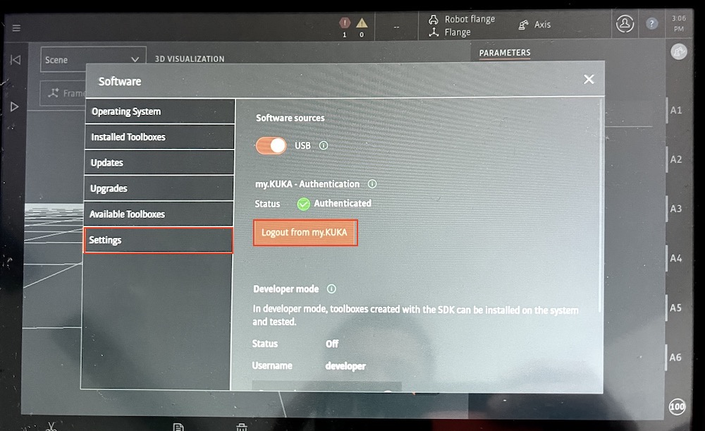

# How to recover the KUKA Controller

It may happen that a reboot of the KUKA controller fails.

In this case, a rescue stick can be used to install a working version of OS.

## Hardware

This chapter describes some hardware components involved in this process.

### The Controller and it's Ports

Different ports are available on the controller.

**Figure 1: Ports available on the KUKA Controller**

1. is the USB port (type A) used for the additional USB (which contains OS-Images or bundle updates)
2. this USB port (type A) is reserved for the **Rescue Stick**
3. the port used for the SmartPad

### Rescue Stick

We have 2 rescue stick (USB type A) in our office in the TH13:

1. one containing the SWU file for the SmartPad Firmware
2. one containing the Recovery Software for the Controller

The easiest way to check for the right stick is to plug it to your machine (over the USB port)
and check it content. The one reserved for the SmartPad contains an SWU file with a corresponding name.

Make sure to use the appropriate one.

**Figure 2: KUKA Recovery Stick**

## Turning off or Rebooting the controller

The controller can be turned off (and rebooted afterward) using `$ sudo shutdown -r now`. Also `$ poweroff --reboot`
will do the job.

To reboot use: `$ sudo reboot`

### Shelly Plug

The controller is connected to the outlet via a smart plug (a **Shelly Plug**). This can be used to remotely turn the
controller on or off.

To access the Web UI use the following URL `http://172.27.5.132/`.

Note: **You need to be connected to the MaibornWolff network (use VPN from home)**

**Figure 3: The Web UI of the Smart Plug the KUKA Controller is connected to**

## How to recover

- Reboot the controller and choose the **rescue mode**
    - Credential are requested for the login into the rescue stick, but you can ignore this (login is not necessary)
        - but in case you need to, ask a colleague or have a look at the main README.md file under the section **
          Credentials**
- Download a KUKA OS:
  e.g. [krc5_iiqka_branntweinbach_1.0.18_internal.swu from the JFrog Artifactory](https://pkg.rd.kuka.com/ui/native/global-staging-generic-virtual/kuka/deploy/base/iiqka/branntweinbach/krc5_iiqka_branntweinbach_1.0.18_internal.swu)
- Open the following URL (**KUKA Software Factory Setup**) to be able to restore a given KUKA
  OS: [SWUpdate - Software Update for Embedded Systems](http://172.27.5.126:8080/)
- Per **drag and drop**, put the `swu` file into the **Software Update** windows (see the screenshot below)
    - notice that an **installation** is triggered just after the **drag and drop**. **You have to wait until it is done
      and the reboot occurs**
- Then login to the Controller using `$ ssh kuka@172.27.5.126`
- Then use `sudo -i` to have root access

> Note: if you already have the Linux OS image you need on the USB stick, you don't need to download it.
>
> Since the USB stick is formatted with `ext4` filesystem, you cannot see and use it on a Mac (missing support for ext4)
>
> for the update operation though drag and drop.
>
> One workaround here is to install a Linux-VM on your Mac and mount the USB stick.

**Figure 4: Start-up Screen on the Display attached to the Controller (ignore the login prompt)**

### Accessing the SmartPad UI

You can access the UI of the SmartPad using the following URL `https://172.27.5.126`

**If you want to access the SmartPad, the base bundle shall be installed beforehand.**

#### Notes

> Remember that you need to have the **right version of the rescue stick** (compatible to the KUKA OS version),
> in order to properly use the rescue stick for KUKA OS update. Check the mapping between the OS version and the Rescue
> Stick
>
here: [quality_gate/variables_system_images.yml](https://dev.azure.com/kuka/RoX%20OS/_git/rox_deployment?path=/quality_gate/variables_system_images.yml)

> To have the **SmartPad UI running**, the **base bundle** has to be installed and running on the controller.

##### Update the Rescue Stick (if necessary)

[Update Rescue Stick](https://wiki.rd.kuka.com/devwiki/Controller_Tools_iiQKA.OS#Update_Rescue_Stick)

#### Update to a different KUKA OS

1. ssh to the controller `$ ssh kuka@172.27.5.126`
2. Call `$ update-agent list` then pick the identifier of the OS version you would like to install
   (in our case `1.1.3`) and call `$ update-agent install -k 1.1.3` to trigger the installation.

## Accessing the SmartPad (login with a customer account)

1. choose e.g. the Admin role
2. login with using the well know KUKA password (for the password ask a colleague or have a look at the main README.md
   file under the section **Credentials**).
3. then access the **my.KUKA Authentication** mask `System Information/Settings` (see screenshots below)
   Use e.g. `mykukademo+customer1@gmail.com` (for the password ask a colleague or have a look at the main README.md file
   under the section **Credentials**)

**Figure 5: Startup Screen on the SmartPad**

**Figure 6: Accessing the System Information mask**

**Figure 7: Authenticate with my.KUKA credentials**

## Resources

- [Linux Development VM - Issues](https://wiki.rd.kuka.com/devwiki/Linux_Development_VM_-_Issues)
- [Create KUKA-Linux Rescue Stick](https://wiki.rd.kuka.com/devwiki/Create_KUKA-Linux_Rescue_Stick)
- [Install KUKA-Linux - Manually](https://wiki.rd.kuka.com/devwiki/Install_KUKA-Linux_-_Manually)
- [SWUpdate - Software Update for Embedded Systems](http://172.27.5.126:8080/)