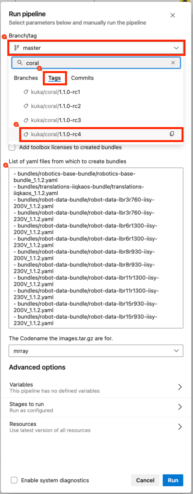
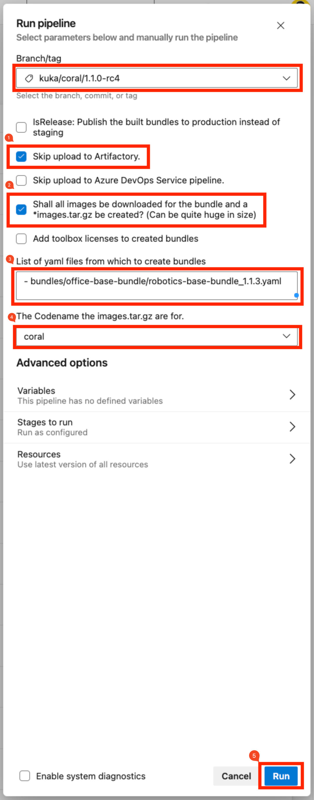
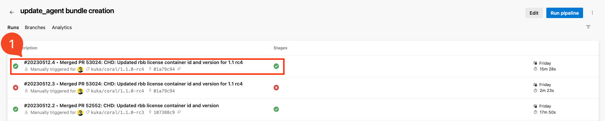
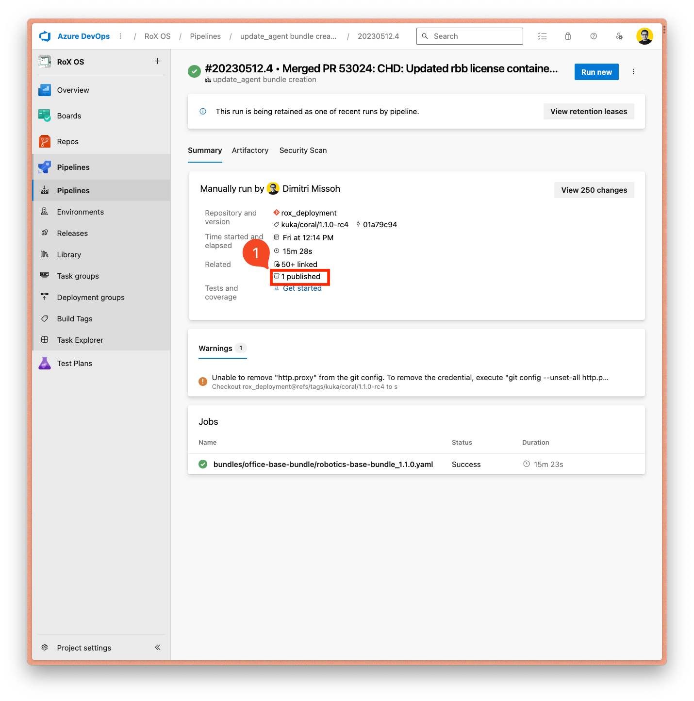
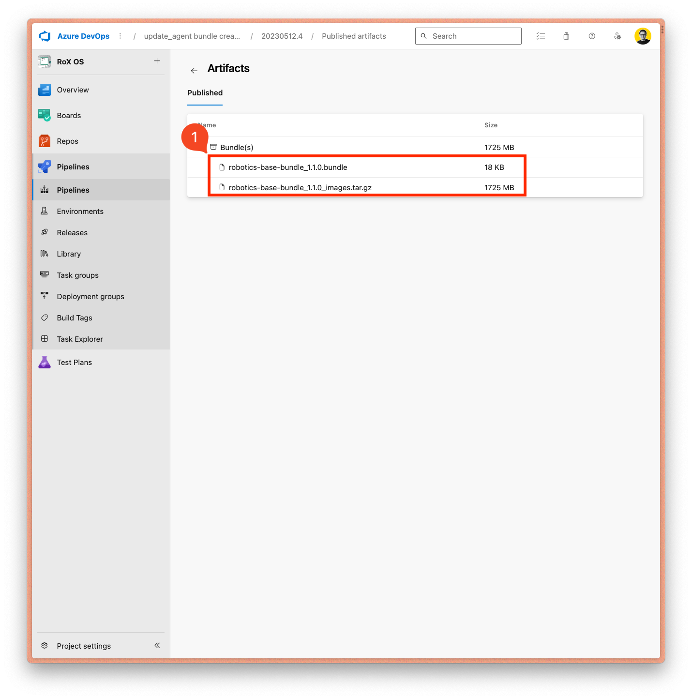

# How to create an office base bundle

The term *office* is used by KUKA to denote that an artifact is dedicated to a controller
that is not used in a classical productive way (attached to a robot arm).

This is the setup we have in our MaibornWolff office in the TH13 with:

- a Controller (KRC5) and
- an attached SmartPad

In order to have a running setup, with a SmartPad that can access and interact with the controller, it is not only
necessary to have a KUKA Linux OS installed on the controller **but also a valid base bundle**.

The **recommended** way to generate a base bundle is through the use
of the following pipeline:

[https://dev.azure.com/kuka/RoX%20OS/_build?definitionId=2290](https://dev.azure.com/kuka/RoX%20OS/_build?definitionId=2290)

Note: There is also an alternative way based on the use of ansible script as describe under [./controller_test.md](../devdoc/controller_tests.md)

## Steps

1. go to the [pipeline](https://dev.azure.com/kuka/RoX%20OS/_build?definitionId=2290)
2. click on [Run pipeline]
3. in the dropdown menu under **Branch/tag** select latest `kuka/coral/1.1.0-rc4`. Use the filter **Tags** `coral` [Screenshot 1: 1, 2, 3](#screenshot-1)
4. Select **only** the options
   `Skip upload to Artifactory` and `Shall all images be downloaded for the bundle and a *images.tar.gz be created? (Can be quite huge in size)`. (Screenshot 2: 1, 2)
5. In the list under **List of yaml files from which to create bundles** remove everything except: [Screenshot 2: 3](#screenshot-2)
   `- bundles/robotics-base-bundle/robotics-base-bundle_1.1.2.yaml` and rename it to
   `- bundles/robotics-base-bundle/office-base-bundle_1.1.2.yaml` (use of the **office** prefix is very important). If
   you need another version than the one displayed (in this example `1.1.2`), change it accordingly.
6. Under the dropdown menu **The Codename the images.tar.gz are for.** choose `coral`. [Screenshot 2: 4](#screenshot-2)
7. Click on [Run] [Screenshot 2: 5](#screenshot-2)
8. Wait until the build is done.
9. Click on the corresponding job. [Screenshot 3: 1](#screenshot-3)
10. View the published artefact by clicking on `1 published`. [Screenshot 4: 1](#screenshot-4)
11. Download both the `*.bundle` and the image `*_images.tar.gz`. [Screenshot 5: 1](#screenshot-5)

### Screenshot 1

### Screenshot 2

### Screenshot 3

### Screenshot 4

### Screenshot 5

