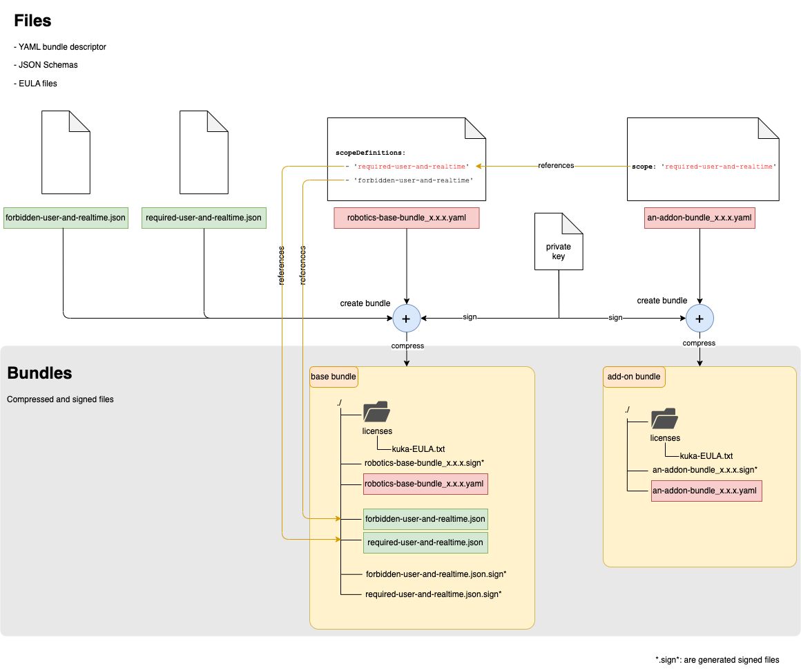

# Add-On Scope Verification

This section outlines the implementation of scopes for add-ons and illustrates the structure and dependencies that must
be met by an add-on bundle in relation to the corresponding base bundle.

The related concept documents are accessible at: [scope_for_addon_bundle.md](./concepts/scope_for_addon_bundle.md).

The following two sections elucidate:

1. The requisite steps for the bundle author.
2. The verification procedures carried out by the update-agent prior to a bundle installation.

## I- Defines scope grammar and create bundles (done by the bundle author)

The fundamental objective is to establish a method to validate and limit the keys and values that an add-on bundle can
set, providing finer control over its capabilities. This is what we refer to as the **scope** of an add-on bundle.

The [concept document](./concepts/scope_for_addon_bundle.md) illustrates this with an example of three properties that
can be managed within a scope:

1. Definition of a Podman container **user**, which influences whether a specific container can be run as root.
2. The Podman **realtime** flag.
3. The list of **capAdd** that a container is permitted to set.

The scope, which signifies what an add-on bundle is authorized to define in its YAML descriptor, establishes a syntax
that the update-agent verifies.

To define this syntax, we have chosen the **JSON Schema** standard, which can also be conveniently applied to YAML files.

The process can be summarized in the following steps:

1. Modify the [JSON Schema](./../internal/business/validation/references/bundle-schema.json)
   (by adding restrictions) to establish a new grammar for addon bundles.
2. Generate a base bundle using the command specified in the **Create a base bundle with additional JSON Schema**
   section of [./how_to_bundle.md](./how_to_bundle.md)
    - with supplementary syntaxes, i.e., a list of JSON Schemas that will be signed and compressed within the **base .bundle file**
    - specify the list of JSON Schemas in the `scopeDefinitions` as explained in [bundle_description.md](./bundle_description.md)
3. Create an add-on bundle (using the command as indicated in the **Create .bundle** section of [./how_to_bundle.md](./how_to_bundle.md))
   - refer to one of the scopes from `scopeDefinitions` provided by the base bundle using the `scope` keyword as explained
     in [bundle_description.md](./bundle_description.md). This will be the syntax (JSON Schema) that the add-on bundle
     will be validated against prior to installation.

The diagram below depicts the creation stages and how the different components of the bundles reference each other.

**Figure 1: Definition of scopes for add-ons**

## II- Validation process (done by the `update-agent`)

During the installation process, just before a bundle is installed, the `update-agent` will:

1. Unpack the base bundle file and verify the signature of the descriptor as well as the signature of the JSON Schemas
2. Parse the add-on bundle and verify if a scope is defined by also parsing the base bundle definition.
   - If this is the case:
     - It confirms if the defined scope is a valid one, i.e., if it is one of the scopes defined in the base bundle
       within `scopeDefinitions`.
     - Extract the corresponding JSON Schema from the base bundle.
     - Validate the add-on bundle YAML descriptor against this JSON Schema.
   - If not, no scope validation is performed (to maintain backward compatibility with older versions).
3. If a validation error arises during the addon bundle validation, the installation is canceled.
   If not, the addon bundle is installed.

## Remarks

Please note that with the introduction of JSON Schema validation for scopes, we have also seized the opportunity to
validate the entire descriptor files for the add-on bundles.

A good introduction to JSON Schema can be found on the [official page](https://json-schema.org/learn/getting-started-step-by-step).

KUKA specific examples can be found under:

- [add-on bundle JSON Schema](./../internal/business/validation/references/addon-schema.json)
- [base bundle JSON Schema](./../internal/business/validation/references/bundle-schema.json)
- [example of base bundle YAML descriptor](./../internal/business/validation/references/robotics-base-bundle_1.1.0.yaml)
- [example of an add-on bundle YAML descriptor](./../internal/business/validation/references/gripper-toolbox-bundle_1.2.0.yaml)
