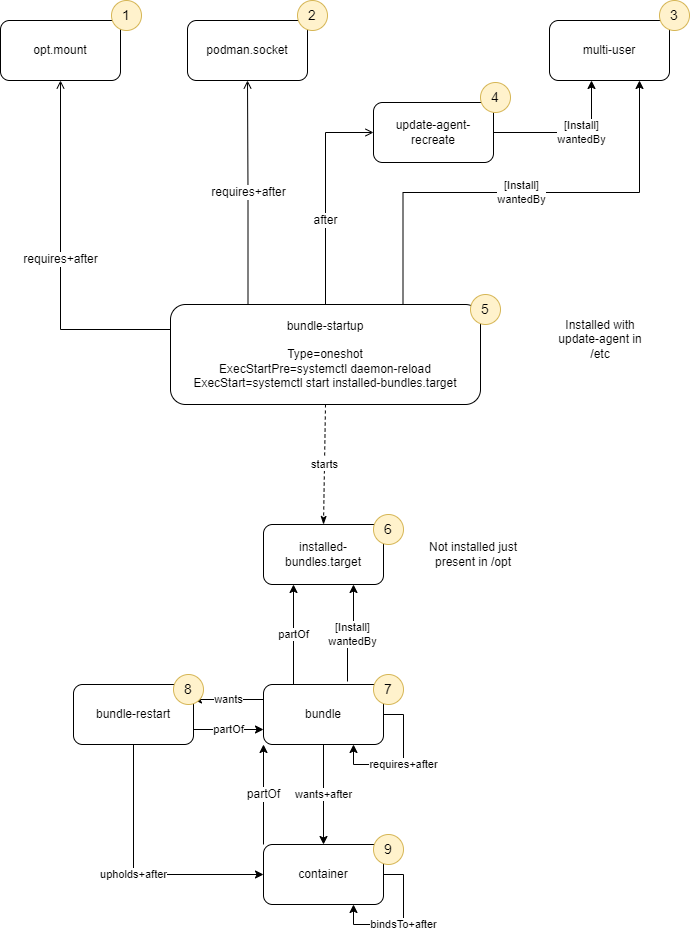

# Systemd

Systemd is responsible for starting and stopping bundles and its containers.
The [documentation of system unit-files](https://www.freedesktop.org/software/systemd/man/systemd.unit.html) is helpful
for understanding this section.

The systemd unit files, which are managed by the update-agent are written to `/opt/operation/systemd-units`.

The basic structure of the units generated and used by the update-agent is as follows:



## Unit-Files

### 1. opt.mount (mount)

Mount managed by the operating system, that is invoked on system startup. It mounts the /opt directory, which contains
the unit files managed by the update agent.

### 2. podman (socket)

The podman socket is managed by the operating system and invoked on system startup. All container services require
podman, which is why it needs to be up first.

### 3. multi-user (target)

Target managed by the operating system, that is invoked on system startup

### 4. update-agent-recreate (service)

It is a one shot service responsible for recreating containers of installed bundles with outdated devices
(see: [tracking_device_versions](./tracking_device_versions.md)).

### 5. bundle-startup (service)

It is a one shot service responsible for starting the installed-bundles target. Prior to that it does a systemctl daemon
reload to load the units in /opt/operation/systemd-units

#### Creation

Will be created by the Debian package of the update agent, so the update-agent can always assume that this service
exists.

#### Dependencies

* **WantedBy multi-user**: This is our hook-up in the started process. Reverse Install-dependency (standard for hooking
  into startup)
* **Requires+After podman**: All services require podman, because they are started and stopped by podman.
* **Requires+After opt.mount**: All unit files managed by the update agent are located on /opt/operation/systemd-units,
  so /opt needs to be mounted for them to be loaded.

### 6. installed-bundles (target)

It is responsible for starting and stopping all bundles managed by the update-agent. It does not have any dependencies.
It gets started by bundle-startup. Service exactly once during startup.

#### Creation

Will be created by the Debian package of the update agent, so the update-agent can always assume that this target
exists. Also its .wants/ directory gets created by the debian package.

### 7. bundle (target)

Is responsible for starting all containers of a bundle

#### Creation

Will be created by the update-agent, when a bundle is installed.

#### Dependencies

* **PartOf installed-bundles**: Makes sure that start and stop are triggered when starting/stopping installed-bundles.
  We explicitly only want start/stop to trigger and not make the installed-bundles state dependent on the bundles
  because that could possibly hinder startup of bundles which could run on their own.
  Reverse Install-dependency to avoid changing the installed-bundles target directly.
* **WantedBy installed-bundles**: Makes sure that installed-bundles.target remains active even when dependencies are
  restarting.
* **Wants+After container**: All service containers that are part of a bundle are referenced here.
  The update-agent has to make sure that wanted containers are eventually started. We cannot use Requires as this
  restarts the whole bundle, when on container fails to start.
* **Wants bundle-restart**: Start the restart target to make sure all containers are restarted when not active.
* **Requires+After bundle**: This expresses dependencies to other bundle-targets. Deferred from the requires-list in the
  bundles description.

We explicitly use the combination to make sure no bundles starts without its dependencies available (requires) and that
the dependencies have successfully started up (after).

### 8. bundle-restart (target)

Is responsible for upholding all containers of a bundle, i.e. restarting them when not active.

#### Creation

Will be created by the update-agent, when a bundle is installed.

#### Dependencies

* **PartOf bundle**: Makes sure this is stopped when bundle ist stopped.
* **Upholds+After container**: Restart containers that become inactive until bundle is stopped.

### 9. container (service)

Is responsible for starting a container created by the update-agent.

#### Creation

Will be created by the update-agent, when a bundle is installed.

#### Dependencies

* **BindsTo+After container**: This expresses dependencies to other containers in the bundle. Deferred from the
  container.requires list in the bundle description.
  BindsTo makes sure that containers are stopped, when their dependency is stopped.
* **PartOf bundle**: Makes sure all containers are stopped when bundle is stopped. Starting is also triggered by the
  bundles requires relation.

#### Properties

These properties are special to the service:

* The containers are started with `Restart=always`, so that they are restarted automatically in case of an failure.
* The containers are started via `ExecStart` and `ExecStop` respectively which are set to `podman start {containername}`
  and `podman stop {containername}`
* The container has to send a sd-notify message, so that systemd knows, that it is ready.
      ```
      "Type=notify"
      "NotifyAccess=all"
      ```
* Optionally the parameters `TimeoutStartSec` and `TimeoutStopSec` are set to the values provided through the
  bundle-description. This can be especially useful if a container is known to start very slowly. If no values are
  provided by the DEV-Team these parameters are skipped, and systemd will use it's default values to start and stop
  services.
